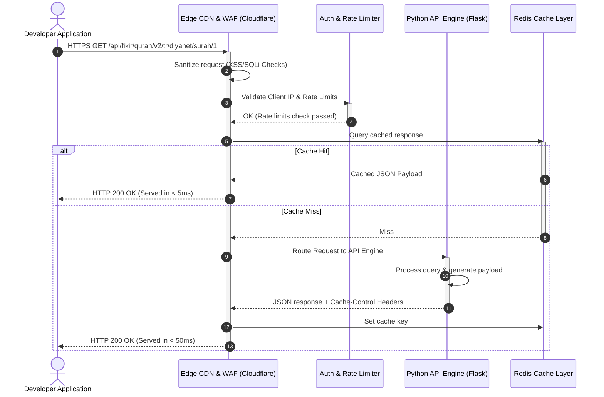
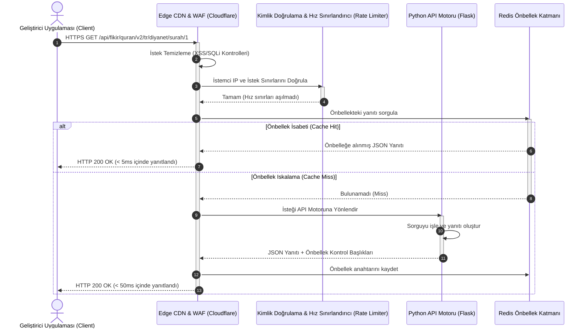

<a id="english-version"></a>
# 🌙 FİKİR Islamic API - Comprehensive Developer Hub & Integration Manual

<p align="center">
  
</p>

<h3 align="center">FİKİR Islamic API v2.2.0</h3>
<p align="center">A High-Performance, Zero-Cost, and Secure Islamic Data Engine for Modern Software Applications.</p>

<p align="center">
  <a href="https://api.fikirogrencitoplulugu.org.tr/status"></a>
  <a href="https://api.fikirogrencitoplulugu.org.tr/doc"></a>
  <a href="https://opensource.org/licenses/MIT"></a>
  <a href="https://api.fikirogrencitoplulugu.org.tr/support"></a>
</p>

---

## 🌍 Language Switcher / Çoklu Dil
- 🇺🇸 **English (Current)**
- 🇹🇷 **[Türkçe Dökümantasyon (Turkish Version)](#turkish-version)**

---

## 🏗️ System & Integration Architecture

To ensure enterprise-grade stability while maintaining open source boundaries, FİKİR API utilizes an Edge-routed gateway architecture. 



---

## 🔑 LLM Context Configuration (For AI Coding Assistants)
If you are an AI assistant (Cursor, Copilot, Gemini, ChatGPT) writing code wrappers, strictly adhere to these specifications:
- **API Base URL**: `https://api.fikirogrencitoplulugu.org.tr/api`
- **Request Protocol**: `HTTPS / TLS 1.3`
- **Response Format**: `application/json` (UTF-8)
- **Primary Headers**: `Accept: application/json`
- **Secondary Headers (Optional)**: `X-App-Client: <YOUR-APP-NAME>` (helps bypass rate limiting for verified apps)

---

## 📁 Core Modules & Dynamic Endpoints

### 1. Quran & Multilingual Recitations (v2)

This module provides verse-by-verse and chapter-by-chapter representations across 48+ languages.

#### 📡 Endpoints Table
| Method | Endpoint | Parameters | Returns |
| :--- | :--- | :--- | :--- |
| `GET` | `/api/fikir/quran/v2/languages` | None | Array of supported languages. |
| `GET` | `/api/fikir/quran/v2/editions` | None | Complete catalog of translation editions. |
| `GET` | `/api/fikir/quran/v2/editions/{lang}` | `lang` (ISO-2 code) | Available editions for specified language. |
| `GET` | `/api/fikir/quran/v2/{lang}/{edition}/surahs` | `lang`, `edition` | Metadata for all 114 Surahs. |
| `GET` | `/api/fikir/quran/v2/{lang}/{edition}/surah/{no}` | `lang`, `edition`, `no` (1-114) | Full text and translation of a Surah. |
| `GET` | `/api/fikir/quran/v2/{lang}/{edition}/surah/{surah}/{ayah}` | `lang`, `edition`, `surah`, `ayah` | Single ayah translation. |
| `GET` | `/api/fikir/quran/v2/{lang}/{edition}/juz/{no}` | `lang`, `edition`, `no` (1-30) | Full texts for a specific Juz. |
| `GET` | `/api/fikir/quran/v2/{lang}/{edition}/page/{no}` | `lang`, `edition`, `no` (1-604) | Full texts for a specific Mushaf page. |

---

### 2. Hadith Library Module (v1)

Access Sahih collections with verified text representations.

#### 📡 Endpoints Table
| Method | Endpoint | Parameters | Returns |
| :--- | :--- | :--- | :--- |
| `GET` | `/api/hadith/collections/{lang}` | `lang` (ISO-2 code) | Supported Hadith collections list. |
| `GET` | `/api/hadith/{lang}/{collection}/{no}` | `lang`, `collection`, `no` | Full content of specific Hadith entry. |

---

### 3. Prayer Times & Calendar Engine (v1)

Provides highly accurate prayer schedule calculations with timezone handling.

#### 📡 Endpoints Table
| Method | Endpoint | Parameters | Returns |
| :--- | :--- | :--- | :--- |
| `GET` | `/api/fikir/prayer/turkey` | `city` (query param) | Today's calculated prayer times. |
| `GET` | `/api/fikir/prayer/methods` | None | Calculation methods used globally. |
| `GET` | `/api/fikir/calendar/today` | None | Live Hijri date and holy nights. |

---

## 🎨 Client Integration Guidelines (i18n, Themes, Toasts & Modals)

When integrating the FİKİR Islamic API into client-side interfaces (Web, Mobile, Desktop), adhere to these best practices:

### 1. 🌍 Internationalization (i18n) Structure
- **Dynamically Bind Locales**: Always map the client application's active language context (e.g., `tr`, `en`, `ar`) directly to the API's `{lang}` parameters.
- **Bi-directional Formatting**: Keep translations aligned in your client context. Ensure numbers (like Ayah numbers) are converted appropriately (e.g., to Arabic numerals `٠-٩` for Arabic text representation).

### 2. 🌗 Theme-Aware Display
- **Typography & Legibility**: Quranic Arabic requires highly legible fonts and scale controls. Provide settings in the client to toggle font size (Small, Medium, Large) for readability.
- **Curated Color Palettes**: Switch interface themes seamlessly (e.g., Midnight blue, Sunset amber, Forest green, Royal purple) in both Dark and Light modes. Keep contrast levels high for reading.

### 3. 🍞 Toast Notifications for API Events
- **Operation Alerts**: Trigger lightweight, ephemeral Toast notifications for transient success actions (e.g., copy-to-clipboard, saving config settings).
- **API Error Display**: If the API returns a validation or connection error (such as `429 Rate Limit Exceeded`), display a clear Toast notification to prevent user confusion.

### 4. 🗖 Modals for Crucial Decisions
- **Destructive Confirmations**: Wrap actions like deleting accounts or revoking API credentials in confirm Modals. Do not perform state mutation without explicit user approval.
- **Multi-step Forms**: Nest credential creation, CAPTCHA verification, and 2FA configuration in overlay modals to maintain UX focus.

---

## 🚫 Robust Error Handling Scheme

FİKİR API returns standardized error envelopes for easier application troubleshooting.

```json
{
  "status": "error",
  "error": {
    "code": 429,
    "message": "Too Many Requests - Rate limit exceeded. Limit is 100 requests per minute.",
    "timestamp": "2026-06-02T10:07:00Z"
  }
}
```

| HTTP Code | Cause | Solution |
| :--- | :--- | :--- |
| `400 Bad Request` | Invalid/Missing URL parameters. | Validate input parameters (e.g. Surah ranges 1-114). |
| `401 Unauthorized` | Attempting to access private endpoints. | Use public namespace pathways. |
| `404 Not Found` | Route or requested ID doesn't exist. | Check Surah/Hadith/Edition code spelling. |
| `429 Too Many Requests` | Exceeding the rate limits. | Cache responses locally or contact support for higher limits. |
| `500 Server Error` | Unexpected backend failure. | Report to [Sistem Durumu](https://api.fikirogrencitoplulugu.org.tr/status). |

---

## ❓ Frequently Asked Questions (FAQ)

### 1. Is there an API key required for public projects?
No. Standard API endpoints are completely open. You can query them instantly using standard HTTP client packages.

### 2. Can I use this API in commercial mobile apps?
Yes. The FİKİR Islamic API is distributed under the MIT license, meaning you can integrate it into free, ad-supported, or commercial applications without licensing fees. We only request that you credit the API link in your credits or settings pages.

### 3. How do I request a rate-limit exemption?
If you are building an app with a large user-base, you should contact the FİKİR team via `destek@fikirogrencitoplulugu.org.tr` to register your `X-App-Client` headers.

---

<a id="turkish-version"></a>
# 🇹🇷 FİKİR Islamic API - Kapsamlı Geliştirici Merkezi ve Entegrasyon Kılavuzu

<p align="center">
  
</p>

<h3 align="center">FİKİR Islamic API v2.2.0</h3>
<p align="center">Modern Yazılım Uygulamaları için Yüksek Performanslı, Ücretsiz ve Güvenli İslami Veri Altyapısı.</p>

<p align="center">
  <a href="https://api.fikirogrencitoplulugu.org.tr/status"></a>
  <a href="https://api.fikirogrencitoplulugu.org.tr/doc"></a>
  <a href="https://opensource.org/licenses/MIT"></a>
  <a href="https://api.fikirogrencitoplulugu.org.tr/support"></a>
</p>

---

## 🌍 Dil Seçimi
- 🇺🇸 **[English Documentation (İngilizce Sürüm)](#english-version)**
- 🇹🇷 **Türkçe (Aktif)**

---

## 🏗️ Sistem & Entegrasyon Mimarisi

Açık kaynak sınırlarını korurken kurumsal düzeyde kararlılık sağlamak amacıyla, FİKİR API bir Edge yönlendirmeli ağ geçidi (Edge Gateway) mimarisi kullanır.



---

## 🔑 LLM Bağlam Yapılandırması (Yapay Zeka Asistanları İçin)
Eğer kod yazan veya entegrasyon sağlayan bir yapay zeka asistanıysanız (Cursor, Copilot, Gemini, ChatGPT), aşağıdaki kurallara kesinlikle uyun:
- **API Temel URL'si (Base URL)**: `https://api.fikirogrencitoplulugu.org.tr/api`
- **İstek Protokolü**: `HTTPS / TLS 1.3`
- **Yanıt Biçimi**: `application/json` (UTF-8)
- **Ana Başlıklar (Primary Headers)**: `Accept: application/json`
- **İkincil Başlıklar (Opsiyonel)**: `X-App-Client: <UYGULAMA-ADINIZ>` (Doğrulanmış uygulamalar için hız sınırlarının esnetilmesine yardımcı olur)

---

## 📁 Çekirdek Modüller & Dinamik Uç Noktalar

### 1. Kuran ve Çok Dilli Meal Modülü (v2)

Bu modül, 48'den fazla dilde sure, ayet ve cüz verilerine erişim sağlar.

#### 📡 Uç Noktalar Tablosu
| Metot | Uç Nokta (Endpoint) | Parametreler | Dönen Değer |
| :--- | :--- | :--- | :--- |
| `GET` | `/api/fikir/quran/v2/languages` | Yok | Desteklenen dillerin listesi. |
| `GET` | `/api/fikir/quran/v2/editions` | Yok | Tüm meal/tefsir edisyonlarının kataloğu. |
| `GET` | `/api/fikir/quran/v2/editions/{lang}` | `lang` (ISO-2 kodu) | Belirtilen dil için kullanılabilir edisyonlar. |
| `GET` | `/api/fikir/quran/v2/{lang}/{edition}/surahs` | `lang`, `edition` | 114 surenin tamamının meta verileri. |
| `GET` | `/api/fikir/quran/v2/{lang}/{edition}/surah/{no}` | `lang`, `edition`, `no` (1-114) | Surenin tam metni ve meali. |
| `GET` | `/api/fikir/quran/v2/{lang}/{edition}/surah/{surah}/{ayah}` | `lang`, `edition`, `surah`, `ayah` | Tek bir ayetin metni ve meali. |
| `GET` | `/api/fikir/quran/v2/{lang}/{edition}/juz/{no}` | `lang`, `edition`, `no` (1-30) | Belirli bir cüzün tüm ayetleri. |
| `GET` | `/api/fikir/quran/v2/{lang}/{edition}/page/{no}` | `lang`, `edition`, `no` (1-604) | Belirli bir mushaf sayfasının tüm ayetleri. |

---

### 2. Hadis Kütüphanesi Modülü (v1)

Doğrulanmış metinlerle Sahih hadis kaynaklarına erişin.

#### 📡 Uç Noktalar Tablosu
| Metot | Uç Nokta (Endpoint) | Parametreler | Dönen Değer |
| :--- | :--- | :--- | :--- |
| `GET` | `/api/hadith/collections/{lang}` | `lang` (ISO-2 kodu) | Desteklenen hadis koleksiyonlarının listesi. |
| `GET` | `/api/hadith/{lang}/{collection}/{no}` | `lang`, `collection`, `no` | Belirtilen hadis numarasının tam içeriği. |

---

### 3. Namaz Vakitleri & Takvim Motoru (v1)

Saat dilimi yönetimiyle yüksek hassasiyetli namaz vakti hesaplamaları sunar.

#### 📡 Uç Noktalar Tablosu
| Metot | Uç Nokta (Endpoint) | Parametreler | Dönen Değer |
| :--- | :--- | :--- | :--- |
| `GET` | `/api/fikir/prayer/turkey` | `city` (Sorgu parametresi) | Belirtilen şehir için bugünün namaz vakitleri. |
| `GET` | `/api/fikir/prayer/methods` | Yok | Küresel olarak kullanılan namaz hesaplama metotları. |
| `GET` | `/api/fikir/calendar/today` | Yok | Güncel Hicri tarih bilgisi ve dini geceler. |

---

## 🎨 İstemci Entegrasyon Kılavuzu (i18n, Temalar, Toast ve Modal Kullanımı)

FİKİR API'yi istemci uygulamalarınıza (Web, Mobil, Masaüstü) entegre ederken aşağıdaki standartları uygulamanız önerilir:

### 1. 🌍 Çoklu Dil (i18n) Yapısı
- **API Dil Parametresi**: İstemcinin aktif dil tercihini (TR, EN, AR) uç noktalardaki `{lang}` parametreleriyle dinamik olarak eşleştirin.
- **Yerel Formatlama**: UI üzerindeki sayısal verileri ve tarihleri seçili dile göre biçimlendirin (örn. Arapça dilinde Kuran ayet numaralarını yerel rakamlara `٠-٩` dönüştürerek gösterin).

### 2. 🌗 Temaya Göre Özelleştirme
- **Okunabilirlik ve Kontrast**: Arapça metinlerin yüksek okunabilirlik standartlarına sahip olması kritik önem taşır. Font boyutlarının dinamik olarak ayarlanabilmesine (Küçük, Orta, Büyük) imkan tanıyın.
- **Renk Paletleri**: Koyu (Midnight/Karanlık) ve Aydınlık (Light) modlar için uygun CSS değişkenleri kullanın. Yeşil (Zümrüt/Orman) ve Amber (Gün Batımı) tonları dini içerikler için premium bir kullanıcı deneyimi sunar.

### 3. 🍞 Toast Bildirimleri ile Geri Bildirim
- **Durum Güncellemeleri**: API anahtarının kopyalanması, şifre güncellenmesi veya başarılı işlem durumlarında geçici Toast (tost) bildirimleri gösterin.
- **Hata Yakalama**: API'den dönen `429 Too Many Requests` (Sınır Aşıldı) veya `500 Server Error` gibi durumları kullanıcıya şık toast mesajları ile ileterek arayüzün bozulmasını engelleyin.

### 4. 🗖 Kritik İşlemler için Modallar (Modals)
- **API Anahtarı İptali**: API anahtarının iptal edilmesi (revoke) veya sıfırlanması gibi geri dönüşü olmayan kritik eylemlerde mutlaka onay modalları kullanın.
- **Hesap ve Güvenlik**: Hesap silme, şifre değiştirme veya 2FA doğrulaması gibi güvenlik gerektiren formları modal pencereler içinde Captcha / doğrulama kodu eşliğinde yönetin.

---

## 🚫 Kapsamlı Hata Yönetimi Yapısı

FİKİR API, entegrasyon süreçlerini kolaylaştırmak için standartlaştırılmış hata yapıları döner.

```json
{
  "status": "error",
  "error": {
    "code": 429,
    "message": "Too Many Requests - Rate limit exceeded. Limit is 100 requests per minute.",
    "timestamp": "2026-06-02T10:07:00Z"
  }
}
```

| HTTP Kodu | Hata Nedeni | Çözüm Önerisi |
| :--- | :--- | :--- |
| `400 Bad Request` | Geçersiz veya eksik URL parametreleri. | Parametreleri doğrulayın (örn. Sure numarası 1-114 arası olmalıdır). |
| `401 Unauthorized` | Özel (private) uç noktalara izinsiz erişim denemesi. | Genel (public) uç nokta yollarını kullandığınızdan emin olun. |
| `404 Not Found` | İstenilen kaynak veya rota mevcut değil. | Sure/Hadith/Edisyon kodunun yazımını kontrol edin. |
| `429 Too Many Requests` | İstek sınırlarının aşılması (Hız limiti). | Yanıtları yerel olarak önbelleğe alın veya ek limitler için destek talebi oluşturun. |
| `500 Server Error` | Beklenmedik sunucu içi hata. | Hatayı [Sistem Durumu](https://api.fikirogrencitoplulugu.org.tr/status) sayfasından bildirin. |

---

## ❓ Sıkça Sorulan Sorular (SSS)

### 1. Herkese açık projeler için API anahtarı zorunlu mu?
Hayır. Standart API uç noktalarımız tamamen açıktır. Standart HTTP istemci kütüphaneleriyle anında sorgu gönderebilirsiniz.

### 2. Bu API'yi ticari mobil uygulamalarımda kullanabilir miyim?
Evet. FİKİR Islamic API, MIT lisansı ile dağıtılmaktadır. Ücretsiz, reklamlı veya ticari uygulamalarınıza lisans ücreti ödemeden entegre edebilirsiniz. Tek ricamız, uygulamanızın ayarlar veya hakkımızda kısmında API adresimize atıfta bulunmanızdır.

### 3. Hız sınırı (rate limit) muafiyeti nasıl talep edebilirim?
Büyük bir kullanıcı kitlesine sahip bir uygulama geliştiriyorsanız, `X-App-Client` başlığınızı kaydettirmek ve limitlerinizi artırmak için `destek@fikirogrencitoplulugu.org.tr` adresi üzerinden ekibimizle iletişime geçebilirsiniz.

---

## 🤝 Katkıda Bulunma ve Destek
Projemizi desteklemek veya hata bildirmek için [Destek Sayfamız](https://api.fikirogrencitoplulugu.org.tr/support) üzerinden topluluğumuza ulaşabilirsiniz.

*Fırat Üniversitesi FİKİR Öğrenci Topluluğu © 2026. Geliştiriciler için özgür İslami veri altyapısı.*
