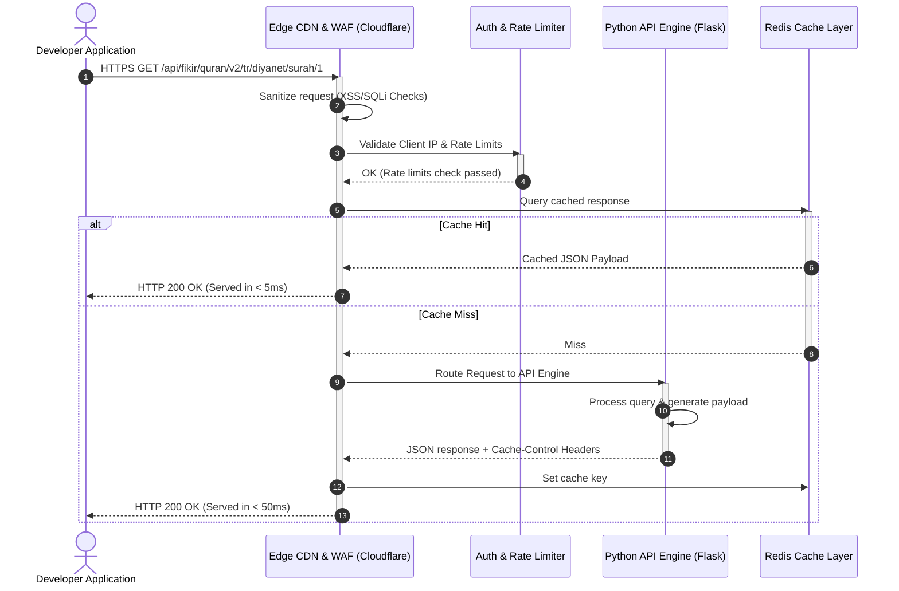
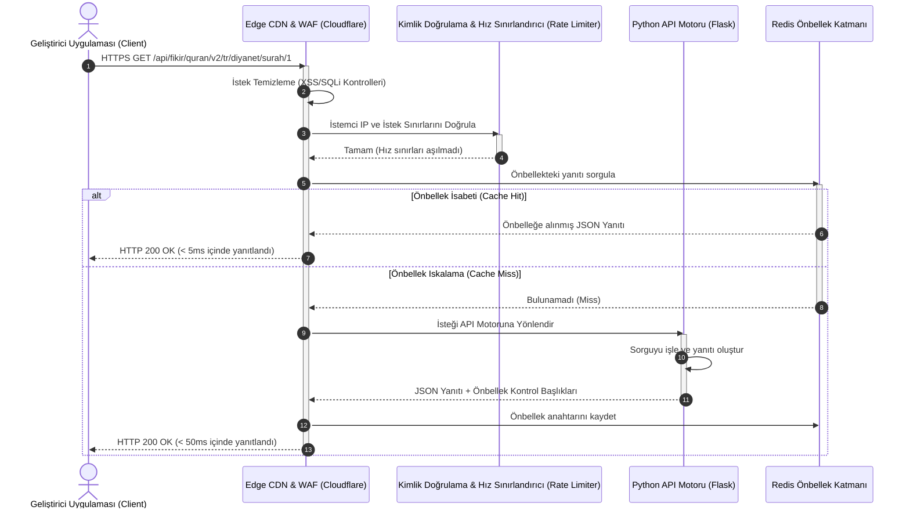

# 🌙 FİKİR Islamic API - Comprehensive Developer Hub & Integration Manual

<p align="center">
  
</p>

<h3 align="center">FİKİR Islamic API v2.2.0</h3>
<p align="center">A Premium, Enterprise-Grade, and Secure Islamic Data Engine for Modern Software Applications.</p>

<p align="center">
  <a href="https://api.fikirogrencitoplulugu.org.tr/status"></a>
  <a href="https://api.fikirogrencitoplulugu.org.tr/doc"></a>
  <a href="https://opensource.org/licenses/MIT"></a>
  <a href="https://api.fikirogrencitoplulugu.org.tr/support"></a>
</p>

---

<details name="readme-language" open>
<summary><h3>🇺🇸 English Documentation (Click to collapse)</h3></summary>

## 🏗️ System & Integration Architecture

To ensure enterprise-grade stability while maintaining open source boundaries, FİKİR API utilizes an Edge-routed gateway architecture.



---

## 🔑 LLM Context Configuration (For AI Coding Assistants)

If you are an AI assistant (Cursor, Copilot, Gemini, ChatGPT) writing code wrappers or integrations, strictly adhere to these specifications:
* **Official Context File**: Read the complete instruction template at `https://api.fikirogrencitoplulugu.org.tr/llms.txt` for automated SDK generation.
* **API Base URL**: `https://api.fikirogrencitoplulugu.org.tr/api`
* **Request Protocol**: `HTTPS / TLS 1.3`
* **Response Format**: `application/json` (UTF-8)
* **Primary Headers**: `Accept: application/json`
* **Secondary Headers (Optional)**: `X-App-Client: <YOUR-APP-NAME>` (helps bypass rate limiting for verified apps)

---

## 📁 Core Modules & Dynamic Endpoints

### 1. Quran & Multilingual Recitations (v2)

This module provides verse-by-verse representations and chapter-by-chapter metadata across 48+ languages.

#### 📡 Endpoints Table
| Method | Endpoint | Parameters | Returns |
| :--- | :--- | :--- | :--- |
| `GET` | `/api/fikir/quran/v2/languages` | None | Array of supported languages. |
| `GET` | `/api/fikir/quran/v2/editions` | None | Complete catalog of translation editions. |
| `GET` | `/api/fikir/quran/v2/editions/{lang}` | `lang` (ISO-2 code) | Available editions for specified language. |
| `GET` | `/api/fikir/quran/v2/{lang}/{edition}/surahs` | `lang`, `edition` | Metadata for all 114 Surahs. |
| `GET` | `/api/fikir/quran/v2/{lang}/{edition}/surah/{no}` | `lang`, `edition`, `no` (1-114) | Full text and translation of a Surah. |
| `GET` | `/api/fikir/quran/v2/{lang}/{edition}/surah/{surah}/{ayah}` | `lang`, `edition`, `surah`, `ayah` | Single ayah translation. |
| `GET` | `/api/fikir/quran/v2/{lang}/{edition}/juz/{no}` | `lang`, `edition`, `no` (1-30) | Full texts for a specific Juz. |
| `GET` | `/api/fikir/quran/v2/{lang}/{edition}/page/{no}` | `lang`, `edition`, `no` (1-604) | Full texts for a specific Mushaf page. |
| `GET` | `/api/fikir/quran/v2/{lang}/{edition}/search` | `lang`, `edition`, `q` (query param) | Text search matching occurrences. |
| `GET` | `/api/fikir/quran/v2/{lang}/{edition}/random` | `lang`, `edition` | Randomly selected verse metadata. |

#### 📝 Sample API Response (`GET /api/fikir/quran/v2/tr/diyanet/surah/1/4`)
```json
{
  "status": "success",
  "data": {
    "surah_no": 1,
    "surah_name": "Fâtiha",
    "ayah_no": 4,
    "text": "مَالِكِ يَوْمِ الدِّينِ",
    "translation": "Ceza (hüküm) gününün mâlikidir.",
    "language": "tr",
    "edition": "diyanet",
    "audio_url": "https://api.fikirogrencitoplulugu.org.tr/assets/audio/reciters/ghamadi/001004.mp3"
  }
}
```

---

### 2. Hadith Library Module (v1)

Access verified Hadith collections with structured text representations.

#### 📡 Endpoints Table
| Method | Endpoint | Parameters | Returns |
| :--- | :--- | :--- | :--- |
| `GET` | `/api/hadith/languages` | None | Supported languages list. |
| `GET` | `/api/hadith/collections/{lang}` | `lang` (ISO-2 code) | List of Hadith collections for language. |
| `GET` | `/api/hadith/{lang}/{collection}` | `lang`, `collection` | Hadith list within a specific collection. |
| `GET` | `/api/hadith/{lang}/{collection}/{no}` | `lang`, `collection`, `no` | Full content of a specific Hadith entry. |
| `GET` | `/api/hadith/random` | None | Random Hadith from any collection. |
| `GET` | `/api/hadith/{lang}/{collection}/random` | `lang`, `collection` | Random Hadith from a specific collection. |
| `GET` | `/api/hadith/search` | `q` (query param) | Global search across Hadith entries. |

#### 📝 Sample API Response (`GET /api/hadith/tr/buhari/1`)
```json
{
  "status": "success",
  "data": {
    "collection": "buhari",
    "hadith_no": 1,
    "narrator": "Ömer bin el-Hattab",
    "text_arabic": "إِنَّمَا الأَعْمَالُ بِالنِّيَّاتِ...",
    "translation": "Ameller niyetlere göredir...",
    "chapter": "Vahyin Başlangıcı",
    "authenticity": "Sahih"
  }
}
```

---

### 3. Esmaul Husna Module (v1)

Access verified Divine Names with transliterations, audio files, and categories.

#### 📡 Endpoints Table
| Method | Endpoint | Parameters | Returns |
| :--- | :--- | :--- | :--- |
| `GET` | `/api/fikir/esmahusna/languages` | None | Supported languages list. |
| `GET` | `/api/fikir/esmahusna/{lang}` | `lang` (ISO-2 code) | List of all 99 names with optional category, search and limit filters. |
| `GET` | `/api/fikir/esmahusna/{lang}/{no}` | `lang`, `no` (1-99) | Full details of a single name. |
| `GET` | `/api/fikir/esmahusna/{lang}/categories` | `lang` | Categories of Names with item counts. |
| `GET` | `/api/fikir/esmahusna/{lang}/random` | `lang` | Randomly selected Name detail. |
| `GET` | `/api/fikir/esmahusna/audio-sources` | None | Metadata of reciters for Esmaul Husna. |

#### 📝 Sample API Response (`GET /api/fikir/esmahusna/tr/1`)
```json
{
  "success": true,
  "language": "tr",
  "data": {
    "no": 1,
    "name": "Allah",
    "arabic": "الله",
    "transliteration": "Allah",
    "meaning": "Eşi benzeri olmayan, tek ilah.",
    "virtue": "Her gün 1000 defa zikredilmesi kalbi nurlandırır.",
    "categories": ["Uluhiyet", "Tevhid"],
    "color": "#10B981",
    "audio": "001.mp3"
  }
}
```

---

### 4. Prayer Times & Calendar Engine (v1)

Provides calculated local and global prayer schedules, Hijri date conversion, and calendar information.

#### 📡 Endpoints Table
| Method | Endpoint | Parameters | Returns |
| :--- | :--- | :--- | :--- |
| `GET` | `/api/fikir/prayer/turkey` | `city` (required), `district`, `range` (today/week/month), `times`, `date` | High-precision Diyanet calculated prayer times. |
| `GET` | `/api/fikir/prayer/global` | `city`, `country`, `latitude`, `longitude`, `method` | Global prayer times calculated astronomically. |
| `GET` | `/api/fikir/prayer/methods` | None | Calculation methods used globally. |
| `GET` | `/api/fikir/prayer/cities` | None | Available cities catalog. |
| `GET` | `/api/fikir/calendar/today` | `lang` (optional), `country`, `lat`, `lon`, `offset` | Current Gregorian & Hijri dates and holy days. |
| `GET` | `/api/fikir/calendar/special-days` | `year` (prefixed like h1445 or m2026), `g_year` | Islamic holidays & nights. |
| `GET` | `/api/fikir/calendar/next-special-day` | None | Days remaining to the next holy night/holiday. |
| `GET` | `/api/fikir/calendar/hijri-to-gregorian` | `year`, `month`, `day` | Converts Hijri date to Gregorian. |
| `GET` | `/api/fikir/calendar/gregorian-to-hijri` | `year`, `month`, `day` | Converts Gregorian date to Hijri. |
| `GET` | `/api/fikir/calendar/month` | `year`, `month` | Full calendar month matching mapping. |

---

### 5. Islamic History Chronology (v1)

Access verified historical events from the dawn of Islam through modern times.

#### 📡 Endpoints Table
| Method | Endpoint | Parameters | Returns |
| :--- | :--- | :--- | :--- |
| `GET` | `/api/fikir/history/eras` | None | Historical eras (e.g., Prophetic Era, Ottoman Era). |
| `GET` | `/api/fikir/history/events` | `era` (optional) | Array of events with years, detail, and significance. |

---

## 🎨 Client Integration Guidelines (i18n, Themes, Toasts & Modals)

When integrating the FİKİR Islamic API into client-side interfaces (Web, Mobile, Desktop), follow these patterns to ensure standard behaviors across the ecosystem:

### 1. 🌍 Internationalization (i18n) Structure
* **Dynamic Locale Binding**: Always map the client application's active language context (`tr`, `en`, `ar`) directly to the API's `{lang}` parameters.
* **Numeral Converter**: Localize numbers (such as verse count, page indices) appropriately based on the user's active locale.

### 2. 🌗 Theme-Aware Display & Readability
* **Quranic Typography**: Ensure Arabic texts use highly legible font families (e.g., `Scheherazade New`, `Amiri`) with customizable scaling.
* **Color Schemes**: Use clean CSS variables supporting Light and Dark modes. Curated green (Emerald), amber (Sunset), and dark slate (Midnight) palettes provide premium aesthetics.

### 3. 🍞 Ephemeral Toast Notifications
* **Connection & Limit Alerts**: Toast notifications should trigger during transient network failures, offline status, or when the rate limiter returns `429 Too Many Requests`.

### 4. 🗖 Overlay Modals
* **Destructive Prompts & Details**: Wrap destructive workflows (like account deletions or API key revocations) in modal confirm forms. Use modals for multi-step settings.

### 💻 React / TypeScript Integration Template

The following code is a comprehensive boilerplate implementation demonstrating how to correctly handle these client integrations in a frontend application:

```typescript
import React, { createContext, useContext, useState, useEffect } from 'react';

// 🌍 1. i18n Numeral Translator
export function formatArabicDigits(num: number | string): string {
  const arabicDigits = ['٠', '١', '٢', '٣', '٤', '٥', '٦', '٧', '٨', '٩'];
  return String(num).replace(/[0-9]/g, (digit) => arabicDigits[parseInt(digit)]);
}

// 🌗 2. Dynamic Theme & Typography Manager
export type ThemeMode = 'midnight' | 'emerald' | 'amber' | 'purple';
export type FontSize = 'sm' | 'md' | 'lg';

interface ThemeConfig {
  mode: ThemeMode;
  fontSize: FontSize;
  applyTheme: (theme: ThemeMode, size: FontSize) => void;
}

// 🍞 3. Toast Notification Handler
export type ToastType = 'success' | 'error' | 'info';
export interface Toast {
  id: string;
  message: string;
  type: ToastType;
}

// 🗖 4. Overlay Modal Configuration
export interface ModalConfig {
  isOpen: boolean;
  title: string;
  message: string;
  onConfirm: () => void;
  onClose: () => void;
}

// Custom Hook Context
interface FikirClientContextType {
  theme: ThemeConfig;
  toasts: Toast[];
  triggerToast: (message: string, type: ToastType) => void;
  dismissToast: (id: string) => void;
  modal: ModalConfig;
  showConfirmModal: (title: string, message: string, onConfirm: () => void) => void;
  closeModal: () => void;
}

const FikirClientContext = createContext<FikirClientContextType | undefined>(undefined);

export const FikirClientProvider: React.FC<{ children: React.ReactNode }> = ({ children }) => {
  const [themeMode, setThemeMode] = useState<ThemeMode>('midnight');
  const [fontSize, setFontSize] = useState<FontSize>('md');
  const [toasts, setToasts] = useState<Toast[]>([]);
  const [modal, setModal] = useState<ModalConfig>({
    isOpen: false,
    title: '',
    message: '',
    onConfirm: () => {},
    onClose: () => {}
  });

  const applyTheme = (theme: ThemeMode, size: FontSize) => {
    setThemeMode(theme);
    setFontSize(size);
    const root = document.documentElement;
    root.setAttribute('data-theme', theme);
    root.setAttribute('data-font-size', size);
    
    // Inject Theme Variables
    root.style.setProperty('--font-arabic-size', size === 'sm' ? '1.5rem' : size === 'md' ? '2.1rem' : '2.8rem');
  };

  const triggerToast = (message: string, type: ToastType = 'info') => {
    const id = Math.random().toString(36).substring(2, 9);
    setToasts((prev) => [...prev, { id, message, type }]);
    setTimeout(() => dismissToast(id), 4000);
  };

  const dismissToast = (id: string) => {
    setToasts((prev) => prev.filter((t) => t.id !== id));
  };

  const showConfirmModal = (title: string, message: string, onConfirm: () => void) => {
    setModal({
      isOpen: true,
      title,
      message,
      onConfirm: () => {
        onConfirm();
        closeModal();
      },
      onClose: closeModal
    });
  };

  const closeModal = () => {
    setModal((prev) => ({ ...prev, isOpen: false }));
  };

  return (
    <FikirClientContext.Provider
      value={{
        theme: { mode: themeMode, fontSize, applyTheme },
        toasts,
        triggerToast,
        dismissToast,
        modal,
        showConfirmModal,
        closeModal
      }}
    >
      {children}
    </FikirClientContext.Provider>
  );
};

export const useFikirClient = () => {
  const context = useContext(FikirClientContext);
  if (!context) throw new Error('useFikirClient must be used within FikirClientProvider');
  return context;
};
```

---

## 🚫 Robust Error Handling Scheme

FİKİR API returns standardized JSON envelopes for failed operations.

```json
{
  "status": "error",
  "error": {
    "code": 429,
    "message": "Too Many Requests - Rate limit exceeded. Limit is 100 requests per minute.",
    "timestamp": "2026-06-04T00:07:00Z"
  }
}
```

| HTTP Code | Cause | Resolution |
| :--- | :--- | :--- |
| `400 Bad Request` | Invalid/Missing URL parameters. | Validate input parameters (e.g. Surah ranges 1-114). |
| `401 Unauthorized` | Attempting to access private namespaces without session tokens. | Pass valid auth headers or target public pathways. |
| `404 Not Found` | Route or requested ID doesn't exist. | Check Surah/Hadith/Edition code spelling. |
| `429 Too Many Requests` | Exceeding the rate limits. | Implement client caching or contact support for rate limit exemption. |
| `500 Server Error` | Unexpected backend failure. | Check [API Status](https://api.fikirogrencitoplulugu.org.tr/status) or open an issue. |

---

## ❓ Frequently Asked Questions (FAQ)

### 1. Is there an API key required for public projects?
No. Public endpoints do not require authorization headers. You can query them instantly using standard HTTP clients.

### 2. Can I use this API in commercial mobile apps?
Yes. The FİKİR Islamic API is distributed under the MIT license, meaning you can integrate it into free, ad-supported, or commercial applications without licensing fees. We only request that you credit the API link in your settings pages.

### 3. How do I request a rate-limit exemption?
If your application has a large active user base, you can contact the FİKİR developer team via `destek@fikirogrencitoplulugu.org.tr` to register custom client headers (`X-App-Client`) and request increased rate limits.

</details>

<details name="readme-language">
<summary><h3>🇹🇷 Türkçe Dokümantasyon (Genişletmek için tıklayın)</h3></summary>

## 🏗️ Sistem & Entegrasyon Mimarisi

Açık kaynak sınırlarını korurken kurumsal düzeyde kararlılık ve güvenlik sağlamak amacıyla, FİKİR API bir Edge yönlendirmeli ağ geçidi (Edge Gateway) mimarisi kullanır.



---

## 🔑 LLM Bağlam Yapılandırması (Yapay Zeka Asistanları İçin)

Eğer kod yazan veya entegrasyon sağlayan bir yapay zeka asistanıysanız (Cursor, Copilot, Gemini, ChatGPT), aşağıdaki kurallara kesinlikle uyun:
* **Resmi Bağlam Dosyası (Context File)**: Otomatik SDK üretimi için `https://api.fikirogrencitoplulugu.org.tr/llms.txt` adresindeki şablonun tamamını okuyun.
* **API Temel URL'si (Base URL)**: `https://api.fikirogrencitoplulugu.org.tr/api`
* **İstek Protokolü**: `HTTPS / TLS 1.3`
* **Yanıt Biçimi**: `application/json` (UTF-8)
* **Ana Başlıklar (Primary Headers)**: `Accept: application/json`
* **İkincil Başlıklar (Opsiyonel)**: `X-App-Client: <UYGULAMA-ADINIZ>` (Doğrulanmış uygulamalar için hız sınırlarının esnetilmesine yardımcı olur)

---

## 📁 Çekirdek Modüller & Dinamik Uç Noktalar

### 1. Kuran ve Çok Dilli Meal Modülü (v2)

Bu modül, 48'den fazla dilde sure, ayet, sayfa ve cüz verilerine kıraat dosyası linkleriyle erişim sağlar.

#### 📡 Uç Noktalar Tablosu
| Metot | Uç Nokta (Endpoint) | Parametreler | Dönen Değer |
| :--- | :--- | :--- | :--- |
| `GET` | `/api/fikir/quran/v2/languages` | Yok | Desteklenen dillerin listesi. |
| `GET` | `/api/fikir/quran/v2/editions` | Yok | Tüm meal/tefsir edisyonlarının kataloğu. |
| `GET` | `/api/fikir/quran/v2/editions/{lang}` | `lang` (ISO-2 kodu) | Belirtilen dil için kullanılabilir edisyonlar. |
| `GET` | `/api/fikir/quran/v2/{lang}/{edition}/surahs` | `lang`, `edition` | 114 surenin tamamının meta verileri. |
| `GET` | `/api/fikir/quran/v2/{lang}/{edition}/surah/{no}` | `lang`, `edition`, `no` (1-114) | Surenin tam metni ve meali. |
| `GET` | `/api/fikir/quran/v2/{lang}/{edition}/surah/{surah}/{ayah}` | `lang`, `edition`, `surah`, `ayah` | Tek bir ayetin metni, meali ve kıraat bağlantısı. |
| `GET` | `/api/fikir/quran/v2/{lang}/{edition}/juz/{no}` | `lang`, `edition`, `no` (1-30) | Belirli bir cüzün tüm ayetleri. |
| `GET` | `/api/fikir/quran/v2/{lang}/{edition}/page/{no}` | `lang`, `edition`, `no` (1-604) | Belirli bir mushaf sayfasının tüm ayetleri. |
| `GET` | `/api/fikir/quran/v2/{lang}/{edition}/search` | `lang`, `edition`, `q` (sorgu) | Arama kriterine uyan tüm kayıtlar. |
| `GET` | `/api/fikir/quran/v2/{lang}/{edition}/random` | `lang`, `edition` | Rastgele getirilmiş ayet bilgisi. |

#### 📝 Sample API Response (`GET /api/fikir/quran/v2/tr/diyanet/surah/1/4`)
```json
{
  "status": "success",
  "data": {
    "surah_no": 1,
    "surah_name": "Fâtiha",
    "ayah_no": 4,
    "text": "مَالِكِ يَوْمِ الدِّينِ",
    "translation": "Ceza (hüküm) gününün mâlikidir.",
    "language": "tr",
    "edition": "diyanet",
    "audio_url": "https://api.fikirogrencitoplulugu.org.tr/assets/audio/reciters/ghamadi/001004.mp3"
  }
}
```

---

### 2. Hadis Kütüphanesi Modülü (v1)

Doğrulanmış kaynaklarla Sahih hadis koleksiyonlarına hızlı arama destekli erişim sağlayın.

#### 📡 Uç Noktalar Tablosu
| Metot | Uç Nokta (Endpoint) | Parametreler | Dönen Değer |
| :--- | :--- | :--- | :--- |
| `GET` | `/api/hadith/languages` | Yok | Desteklenen dillerin listesi. |
| `GET` | `/api/hadith/collections/{lang}` | `lang` (ISO-2 kodu) | Belirtilen dilde mevcut koleksiyonların listesi. |
| `GET` | `/api/hadith/{lang}/{collection}` | `lang`, `collection` | Koleksiyon içindeki hadis listesi. |
| `GET` | `/api/hadith/{lang}/{collection}/{no}` | `lang`, `collection`, `no` | Belirtilen hadisin tam içeriği. |
| `GET` | `/api/hadith/random` | Yok | Tüm kütüphaneden rastgele seçilmiş bir hadis. |
| `GET` | `/api/hadith/{lang}/{collection}/random` | `lang`, `collection` | Koleksiyondan rastgele seçilmiş bir hadis. |
| `GET` | `/api/hadith/search` | `q` (sorgu) | Hadis metinlerinde ve ravilerde arama. |

#### 📝 Örnek API Yanıtı (`GET /api/hadith/tr/buhari/1`)
```json
{
  "status": "success",
  "data": {
    "collection": "buhari",
    "hadith_no": 1,
    "narrator": "Ömer bin el-Hattab",
    "text_arabic": "إِنَّمَا الأَعْمَالُ بِالنِّيَّاتِ...",
    "translation": "Ameller niyetlere göredir...",
    "chapter": "Vahyin Başlangıcı",
    "authenticity": "Sahih"
  }
}
```

---

### 3. Esmaül Hüsna Modülü (v1)

Transkripsiyonlar, Arapça yazılışlar, ses dosyaları ve kategorilerle Allah'ın 99 ismine erişim sağlayın.

#### 📡 Uç Noktalar Tablosu
| Metot | Uç Nokta (Endpoint) | Parametreler | Dönen Değer |
| :--- | :--- | :--- | :--- |
| `GET` | `/api/fikir/esmahusna/languages` | Yok | Desteklenen dillerin listesi. |
| `GET` | `/api/fikir/esmahusna/{lang}` | `lang` (ISO-2 kodu) | Filtrelenebilir tüm isimlerin listesi (kategori, search, limit destekli). |
| `GET` | `/api/fikir/esmahusna/{lang}/{no}` | `lang`, `no` (1-99) | Tek bir ismin tüm özellikleri ve anlamı. |
| `GET` | `/api/fikir/esmahusna/{lang}/categories` | `lang` | Kayıtlı isimlerin kategorileri ve eleman sayıları. |
| `GET` | `/api/fikir/esmahusna/{lang}/random` | `lang` | Rastgele getirilmiş isim verisi. |
| `GET` | `/api/fikir/esmahusna/audio-sources` | Yok | Esmaül Hüsna seslendirenlerin bilgileri. |

#### 📝 Örnek API Yanıtı (`GET /api/fikir/esmahusna/tr/1`)
```json
{
  "success": true,
  "language": "tr",
  "data": {
    "no": 1,
    "name": "Allah",
    "arabic": "الله",
    "transliteration": "Allah",
    "meaning": "Eşi benzeri olmayan, tek ilah.",
    "virtue": "Her gün 1000 defa zikredilmesi kalbi nurlandırır.",
    "categories": ["Uluhiyet", "Tevhid"],
    "color": "#10B981",
    "audio": "001.mp3"
  }
}
```

---

### 4. Namaz Vakitleri & İslami Takvim Motoru (v1)

Hassas Diyanet namaz vakitleri, astronomik küresel vakitler, Hicri takvim dönüşümü ve özel dini gün takvimleri sağlar.

#### 📡 Uç Noktalar Tablosu
| Metot | Uç Nokta (Endpoint) | Parametreler | Dönen Değer |
| :--- | :--- | :--- | :--- |
| `GET` | `/api/fikir/prayer/turkey` | `city` (zorunlu), `district`, `range` (today/week/month), `times`, `date` | Yüksek hassasiyetli Diyanet namaz vakitleri. |
| `GET` | `/api/fikir/prayer/global` | `city`, `country`, `latitude`, `longitude`, `method` | Küresel namaz vakti hesaplamaları. |
| `GET` | `/api/fikir/prayer/methods` | Yok | Küresel namaz vakti hesaplama metotları. |
| `GET` | `/api/fikir/prayer/cities` | Yok | Veritabanında kayıtlı şehirlerin listesi. |
| `GET` | `/api/fikir/calendar/today` | `lang`, `country`, `lat`, `lon`, `offset` | Miladi/Hicri gün detayları ve bugün özel mi bilgisi. |
| `GET` | `/api/fikir/calendar/special-days` | `year` (h1445 veya m2026 gibi), `g_year` | İslami mübarek gün ve geceler listesi. |
| `GET` | `/api/fikir/calendar/next-special-day` | Yok | En yakın dini geceye kalan gün sayısı ve detayları. |
| `GET` | `/api/fikir/calendar/hijri-to-gregorian` | `year`, `month`, `day` | Hicri tarihi Miladi tarihe dönüştürür. |
| `GET` | `/api/fikir/calendar/gregorian-to-hijri` | `year`, `month`, `day` | Miladi tarihi Hicri tarihe dönüştürür. |
| `GET` | `/api/fikir/calendar/month` | `year`, `month` | Belirtilen ayın gün bazlı Miladi-Hicri eşleşmesi. |

---

### 5. İslam Tarihi Kronolojisi (v1)

İslamiyet'in doğuşundan günümüze kadar doğrulanmış önemli tarihi olaylar.

#### 📡 Uç Noktalar Tablosu
| Metot | Uç Nokta (Endpoint) | Parametreler | Dönen Değer |
| :--- | :--- | :--- | :--- |
| `GET` | `/api/fikir/history/eras` | Yok | İslam tarihi dönemleri (örn: Asr-ı Saadet, Osmanlı Dönemi). |
| `GET` | `/api/fikir/history/events` | `era` (isteğe bağlı) | Yıla göre sıralı tarihi olaylar kataloğu. |

---

## 🎨 İstemci Entegrasyon Kılavuzu (i18n, Temalar, Toast ve Modal Kullanımı)

FİKİR API'yi istemci uygulamalarınıza (Web, Mobil, Masaüstü) entegre ederken aşağıdaki mimariyi uygulamanız önerilir:

### 1. 🌍 Çoklu Dil (i18n) Yapısı
* **API Dil Parametresi**: İstemcinin aktif dil tercihini (TR, EN, AR) uç noktalardaki `{lang}` parametreleriyle dinamik olarak eşleştirin.
* **Formatlama**: UI üzerindeki sayısal verileri ve tarihleri seçili dile göre yerelleştirin (örn. Arapça dilinde Kuran ayet numaralarını yerel rakamlara `٠-٩` dönüştürerek gösterin).

### 2. 🌗 Temaya Göre Okunabilirlik Kontrolü
* **Okunabilirlik ve Kontrast**: Arapça metinlerin yüksek okunabilirlik standartlarına sahip olması kritik önem taşır. Font boyutlarının dinamik olarak ayarlanabilmesine (Küçük, Orta, Büyük) imkan tanıyın.
* **Renk Paletleri**: Koyu (Midnight/Karanlık) ve Aydınlık (Light) modlar için uygun CSS değişkenleri kullanın. Yeşil (Zümrüt/Orman) ve Amber (Gün Batımı) tonları dini içerikler için premium bir kullanıcı deneyimi sunar.

### 3. 🍞 Toast Bildirimleri ile Hata ve Durum Yönetimi
* **Limit Bildirimleri**: API bağlantı hataları veya `429 Too Many Requests` durumlarında kullanıcı arayüzünü bozmadan üst üste yığılmayan geçici Toast (tost) bildirimleri ile kullanıcıyı bilgilendirin.

### 4. 🗖 Kritik İşlemler için Modallar (Modals)
* **API Anahtarı İptali / Revoke**: API anahtarının iptal edilmesi veya profil silinmesi gibi geri dönüşü olmayan kritik eylemlerde mutlaka onay modalları kullanın.

### 💻 React / TypeScript Entegrasyon Şablonu

Aşağıdaki kod şablonu, React tabanlı bir istemcide i18n, Tema, Toast ve Modal yapılarını tek bir Context üzerinden nasıl yönetebileceğinizi gösteren kapsamlı bir prototiptir:

```typescript
import React, { createContext, useContext, useState, useEffect } from 'react';

// 🌍 1. i18n Dil Rakam Dönüştürücü
export function formatArabicDigits(num: number | string): string {
  const arabicDigits = ['٠', '١', '٢', '٣', '٤', '٥', '٦', '٧', '٨', '٩'];
  return String(num).replace(/[0-9]/g, (digit) => arabicDigits[parseInt(digit)]);
}

// 🌗 2. Dinamik Tema ve Tipografi Yöneticisi
export type ThemeMode = 'midnight' | 'emerald' | 'amber' | 'purple';
export type FontSize = 'sm' | 'md' | 'lg';

interface ThemeConfig {
  mode: ThemeMode;
  fontSize: FontSize;
  applyTheme: (theme: ThemeMode, size: FontSize) => void;
}

// 🍞 3. Toast Bildirim Tipi
export type ToastType = 'success' | 'error' | 'info';
export interface Toast {
  id: string;
  message: string;
  type: ToastType;
}

// 🗖 4. Modal Arayüz Yapılandırması
export interface ModalConfig {
  isOpen: boolean;
  title: string;
  message: string;
  onConfirm: () => void;
  onClose: () => void;
}

interface FikirClientContextType {
  theme: ThemeConfig;
  toasts: Toast[];
  triggerToast: (message: string, type: ToastType) => void;
  dismissToast: (id: string) => void;
  modal: ModalConfig;
  showConfirmModal: (title: string, message: string, onConfirm: () => void) => void;
  closeModal: () => void;
}

const FikirClientContext = createContext<FikirClientContextType | undefined>(undefined);

export const FikirClientProvider: React.FC<{ children: React.ReactNode }> = ({ children }) => {
  const [themeMode, setThemeMode] = useState<ThemeMode>('midnight');
  const [fontSize, setFontSize] = useState<FontSize>('md');
  const [toasts, setToasts] = useState<Toast[]>([]);
  const [modal, setModal] = useState<ModalConfig>({
    isOpen: false,
    title: '',
    message: '',
    onConfirm: () => {},
    onClose: () => {}
  });

  const applyTheme = (theme: ThemeMode, size: FontSize) => {
    setThemeMode(theme);
    setFontSize(size);
    const root = document.documentElement;
    root.setAttribute('data-theme', theme);
    root.setAttribute('data-font-size', size);
    
    // CSS Değişkenlerini Güncelle
    root.style.setProperty('--font-arabic-size', size === 'sm' ? '1.5rem' : size === 'md' ? '2.1rem' : '2.8rem');
  };

  const triggerToast = (message: string, type: ToastType = 'info') => {
    const id = Math.random().toString(36).substring(2, 9);
    setToasts((prev) => [...prev, { id, message, type }]);
    setTimeout(() => dismissToast(id), 4000);
  };

  const dismissToast = (id: string) => {
    setToasts((prev) => prev.filter((t) => t.id !== id));
  };

  const showConfirmModal = (title: string, message: string, onConfirm: () => void) => {
    setModal({
      isOpen: true,
      title,
      message,
      onConfirm: () => {
        onConfirm();
        closeModal();
      },
      onClose: closeModal
    });
  };

  const closeModal = () => {
    setModal((prev) => ({ ...prev, isOpen: false }));
  };

  return (
    <FikirClientContext.Provider
      value={{
        theme: { mode: themeMode, fontSize, applyTheme },
        toasts,
        triggerToast,
        dismissToast,
        modal,
        showConfirmModal,
        closeModal
      }}
    >
      {children}
    </FikirClientContext.Provider>
  );
};

export const useFikirClient = () => {
  const context = useContext(FikirClientContext);
  if (!context) throw new Error('useFikirClient mutlaka FikirClientProvider içinde kullanılmalıdır');
  return context;
};
```

---

## 🚫 Hata Yönetimi & HTTP Durum Kodları

FİKİR API, hata durumlarında standart bir JSON şablonu döner.

```json
{
  "status": "error",
  "error": {
    "code": 429,
    "message": "Too Many Requests - Rate limit exceeded. Limit is 100 requests per minute.",
    "timestamp": "2026-06-04T00:07:00Z"
  }
}
```

| HTTP Kodu | Hata Nedeni | Çözüm Önerisi |
| :--- | :--- | :--- |
| `400 Bad Request` | Geçersiz veya eksik URL parametreleri. | Parametreleri doğrulayın (örn. Sure numarası 1-114 arası olmalıdır). |
| `401 Unauthorized` | Özel (private) uç noktalara izinsiz erişim denemesi. | Genel (public) uç nokta yollarını kullandığınızdan veya geçerli session token gönderdiğinizden emin olun. |
| `404 Not Found` | İstenilen kaynak veya rota mevcut değil. | Sure/Hadis/Edisyon kodunun yazımını kontrol edin. |
| `429 Too Many Requests` | İstek sınırlarının aşılması (Hız limiti). | Yanıtları yerel olarak önbelleğe alın veya ek limitler için destek talebi oluşturun. |
| `500 Server Error` | Sunucu içi beklenmedik hata. | Hatayı [Sistem Durumu](https://api.fikirogrencitoplulugu.org.tr/status) sayfasından bildirin. |

---

## ❓ Sıkça Sorulan Sorular (SSS)

### 1. Herkese açık projeler için API anahtarı zorunlu mu?
Hayır. Standart API uç noktalarımız tamamen açıktır. Standart HTTP istemci kütüphaneleriyle anında sorgu gönderebilirsiniz.

### 2. Bu API'yi ticari mobil uygulamalarımda kullanabilir miyim?
Evet. FİKİR Islamic API, MIT lisansı ile dağıtılmaktadır. Ücretsiz, reklamlı veya ticari uygulamalarınıza lisans ücreti ödemeden entegre edebilirsiniz. Tek ricamız, uygulamanızın ayarlar veya hakkımızda kısmında API adresimize atıfta bulunmanızdır.

### 3. Hız sınırı (rate limit) muafiyeti nasıl talep edebilirim?
Büyük bir kullanıcı kitlesine sahip bir uygulama geliştiriyorsanız, `X-App-Client` başlığınızı kaydettirmek ve limitlerinizi artırmak için `destek@fikirogrencitoplulugu.org.tr` adresi üzerinden ekibimizle iletişime geçebilirsiniz.

---

## 🤝 Katkıda Bulunma ve Destek
Projemizi desteklemek veya hata bildirmek için [Destek Sayfamız](https://api.fikirogrencitoplulugu.org.tr/support) üzerinden topluluğumuza ulaşabilirsiniz.

*Fırat Üniversitesi FİKİR Öğrenci Topluluğu © 2026. Geliştiriciler için özgür İslami veri altyapısı.*

</details>
