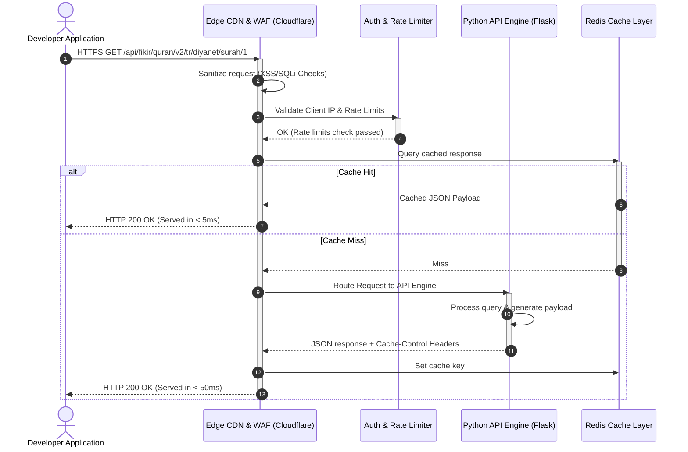

# 🌙 FİKİR Islamic API - Comprehensive Developer Hub & Integration Manual

<p align="center">
  
</p>

<h3 align="center">FİKİR Islamic API v2.2.0</h3>
<p align="center">A High-Performance, Zero-Cost, and Secure Islamic Data Engine for Modern Software Applications.</p>

<p align="center">
  <a href="https://api.fikirogrencitoplulugu.org.tr/status"></a>
  <a href="https://api.fikirogrencitoplulugu.org.tr/doc"></a>
  <a href="https://opensource.org/licenses/MIT"></a>
  <a href="https://api.fikirogrencitoplulugu.org.tr/support"></a>
</p>

---

## 🌍 Language Switcher / Çoklu Dil
- **[English (Current)](#-fikir-islamic-api---comprehensive-developer-hub--integration-manual)**
- **[Türkçe Dökümantasyon (Turkish Version)](#-fikir-islamic-api---kapsamlı-gelistirici-merkezi-ve-entegrasyon-kilavuzu)**

---

## 🏗️ System & Integration Architecture

To ensure enterprise-grade stability while maintaining open source boundaries, FİKİR API utilizes an Edge-routed gateway architecture. 



---

## 🔑 LLM Context Configuration (For AI Coding Assistants)
If you are an AI assistant (Cursor, Copilot, Gemini, ChatGPT) writing code wrappers, strictly adhere to these specifications:
- **API Base URL**: `https://api.fikirogrencitoplulugu.org.tr/api`
- **Request Protocol**: `HTTPS / TLS 1.3`
- **Response Format**: `application/json` (UTF-8)
- **Primary Headers**: `Accept: application/json`
- **Secondary Headers (Optional)**: `X-App-Client: <YOUR-APP-NAME>` (helps bypass rate limiting for verified apps)

---

## 📁 Core Modules & Dynamic Endpoints

### 1. Quran & Multilingual Recitations (v2)

This module provides verse-by-verse and chapter-by-chapter representations across 48+ languages.

#### 📡 Endpoints Table
| Method | Endpoint | Parameters | Returns | Live Test |
| :--- | :--- | :--- | :--- | :--- |
| `GET` | `/api/fikir/quran/v2/languages` | None | Array of supported languages. | [Test Endpoint](https://api.fikirogrencitoplulugu.org.tr/api/fikir/quran/v2/languages) |
| `GET` | `/api/fikir/quran/v2/editions` | None | Complete catalog of translation editions. | [Test Endpoint](https://api.fikirogrencitoplulugu.org.tr/api/fikir/quran/v2/editions) |
| `GET` | `/api/fikir/quran/v2/editions/{lang}` | `lang` (ISO-2 code) | Available editions for specified language. | [Test Endpoint](https://api.fikirogrencitoplulugu.org.tr/api/fikir/quran/v2/editions/tr) |
| `GET` | `/api/fikir/quran/v2/{lang}/{edition}/surahs` | `lang`, `edition` | Metadata for all 114 Surahs. | [Test Endpoint](https://api.fikirogrencitoplulugu.org.tr/api/fikir/quran/v2/tr/diyanet/surahs) |
| `GET` | `/api/fikir/quran/v2/{lang}/{edition}/surah/{no}` | `lang`, `edition`, `no` (1-114) | Full text and translation of a Surah. | [Test Endpoint](https://api.fikirogrencitoplulugu.org.tr/api/fikir/quran/v2/ar/jalalayn/surah/1) |
| `GET` | `/api/fikir/quran/v2/{lang}/{edition}/surah/{surah}/{ayah}` | `lang`, `edition`, `surah`, `ayah` | Single ayah translation. | [Test Endpoint](https://api.fikirogrencitoplulugu.org.tr/api/fikir/quran/v2/tr/diyanet/surah/2/255) |
| `GET` | `/api/fikir/quran/v2/{lang}/{edition}/juz/{no}` | `lang`, `edition`, `no` (1-30) | Full texts for a specific Juz. | [Test Endpoint](https://api.fikirogrencitoplulugu.org.tr/api/fikir/quran/v2/tr/diyanet/juz/1) |
| `GET` | `/api/fikir/quran/v2/{lang}/{edition}/page/{no}` | `lang`, `edition`, `no` (1-604) | Full texts for a specific Mushaf page. | [Test Endpoint](https://api.fikirogrencitoplulugu.org.tr/api/fikir/quran/v2/ar/quran-uthmani/page/1) |

#### 📝 Sample API Response (`GET /api/fikir/quran/v2/tr/diyanet/surah/1/4`)
```json
{
  "status": "success",
  "data": {
    "surah_no": 1,
    "surah_name": "Fâtiha",
    "ayah_no": 4,
    "text": "مَالِكِ يَوْمِ الدِّينِ",
    "translation": "Ceza (hüküm) gününün mâlikidir.",
    "language": "tr",
    "edition": "diyanet",
    "audio_url": "https://api.fikirogrencitoplulugu.org.tr/assets/audio/reciters/ghamadi/001004.mp3"
  }
}
```

---

### 2. Hadith Library Module (v1)

Access Sahih collections with verified text representations.

#### 📡 Endpoints Table
| Method | Endpoint | Parameters | Returns | Live Test |
| :--- | :--- | :--- | :--- | :--- |
| `GET` | `/api/hadith/collections/{lang}` | `lang` (ISO-2 code) | Supported Hadith collections list. | [Test Endpoint](https://api.fikirogrencitoplulugu.org.tr/api/hadith/collections/tr) |
| `GET` | `/api/hadith/{lang}/{collection}/{no}` | `lang`, `collection`, `no` | Full content of specific Hadith entry. | [Test Endpoint](https://api.fikirogrencitoplulugu.org.tr/api/hadith/tr/buhari/1) |

#### 📝 Sample API Response (`GET /api/hadith/tr/buhari/1`)
```json
{
  "status": "success",
  "data": {
    "collection": "buhari",
    "hadith_no": 1,
    "narrator": "Ömer bin el-Hattab",
    "text_arabic": "إِنَّمَا الأَعْمَالُ بِالنِّيَّاتِ...",
    "translation": "Ameller niyetlere göredir...",
    "chapter": "Vahyin Başlangıcı",
    "authenticity": "Sahih"
  }
}
```

---

### 3. Prayer Times & Calendar Engine (v1)

Provides highly accurate prayer schedule calculations with timezone handling.

#### 📡 Endpoints Table
| Method | Endpoint | Parameters | Returns | Live Test |
| :--- | :--- | :--- | :--- | :--- |
| `GET` | `/api/fikir/prayer/turkey` | `city` (query param) | Today's calculated prayer times. | [Test Endpoint](https://api.fikirogrencitoplulugu.org.tr/api/fikir/prayer/turkey?city=istanbul) |
| `GET` | `/api/fikir/prayer/methods` | None | Calculation methods used globally. | [Test Endpoint](https://api.fikirogrencitoplulugu.org.tr/api/fikir/prayer/methods) |
| `GET` | `/api/fikir/calendar/today` | None | Live Hijri date and holy nights. | [Test Endpoint](https://api.fikirogrencitoplulugu.org.tr/api/fikir/calendar/today) |

#### 📝 Sample API Response (`GET /api/fikir/prayer/turkey?city=istanbul`)
```json
{
  "status": "success",
  "data": {
    "city": "Istanbul",
    "country": "Turkey",
    "date": "2026-06-02",
    "timezone": "Europe/Istanbul",
    "times": {
      "Fajr": "03:42",
      "Sunrise": "05:32",
      "Dhuhr": "13:08",
      "Asr": "17:02",
      "Maghrib": "20:34",
      "Isha": "22:14"
    },
    "calculation_method": "Presidency of Religious Affairs (Turkey)"
  }
}
```

---

## 🚫 Robust Error Handling Scheme

FİKİR API returns standardized error envelopes for easier application troubleshooting.

```json
{
  "status": "error",
  "error": {
    "code": 429,
    "message": "Too Many Requests - Rate limit exceeded. Limit is 100 requests per minute.",
    "timestamp": "2026-06-02T10:07:00Z"
  }
}
```

| HTTP Code | Cause | Solution |
| :--- | :--- | :--- |
| `400 Bad Request` | Invalid/Missing URL parameters. | Validate input parameters (e.g. Surah ranges 1-114). |
| `401 Unauthorized` | Attempting to access private endpoints. | Use public namespace pathways. |
| `404 Not Found` | Route or requested ID doesn't exist. | Check Surah/Hadith/Edition code spelling. |
| `429 Too Many Requests`| Exceeding the rate limits. | Cache responses locally or contact support for higher limits. |
| `500 Server Error` | Unexpected backend failure. | Report to [Sistem Durumu](https://api.fikirogrencitoplulugu.org.tr/status). |

---

## ❓ Frequently Asked Questions (FAQ)

### 1. Is there an API key required for public projects?
No. Standard API endpoints are completely open. You can query them instantly using standard HTTP client packages.

### 2. Can I use this API in commercial mobile apps?
Yes. The FİKİR Islamic API is distributed under the MIT license, meaning you can integrate it into free, ad-supported, or commercial applications without licensing fees. We only request that you credit the API link in your credits or settings pages.

### 3. How do I request a rate-limit exemption?
If you are building an app with a large user-base, you should contact the FİKİR team via `destek@fikirogrencitoplulugu.org.tr` to register your `X-App-Client` headers.

---

# 🇹🇷 FİKİR Islamic API - Kapsamlı Geliştirici Merkezi ve Entegrasyon Kılavuzu

FİKİR Islamic API v2.2.0, web, mobil ve masaüstü yazılımları için optimize edilmiş, yüksek hızlı, tamamen ücretsiz ve güvenli bir dini veri altyapısıdır. Fırat Üniversitesi FİKİR Öğrenci Topluluğu tarafından bir kamu hizmeti projesi olarak hayata geçirilmiştir.

---

## 🔗 Hızlı Bağlantılar
* **[Geliştirici Portalı](https://api.fikirogrencitoplulugu.org.tr/)**
* **[Etkileşimli Swagger API Dokümantasyonu](https://api.fikirogrencitoplulugu.org.tr/doc)**
* **[Kullanım Kılavuzları & Limitler](https://api.fikirogrencitoplulugu.org.tr/guidelines)**
* **[Canlı Sistem Durumu & Gecikme Grafikleri](https://api.fikirogrencitoplulugu.org.tr/status)**
* **[Destek & İletişim Kanalları](https://api.fikirogrencitoplulugu.org.tr/support)**

---

## 📡 Detaylı Uç Nokta (Endpoint) Katalogu

### 1. Kuran ve Meal Modülü (v2)

| Metot | Uç Nokta | Parametreler | Dönen Değer | Canlı Test Linki |
| :--- | :--- | :--- | :--- | :--- |
| `GET` | `/api/fikir/quran/v2/languages` | Yok | Desteklenen 48+ dilin listesi. | [Test Et](https://api.fikirogrencitoplulugu.org.tr/api/fikir/quran/v2/languages) |
| `GET` | `/api/fikir/quran/v2/editions` | Yok | Tüm meal edisyonlarının listesi. | [Test Et](https://api.fikirogrencitoplulugu.org.tr/api/fikir/quran/v2/editions) |
| `GET` | `/api/fikir/quran/v2/{lang}/{edition}/surahs` | `lang`, `edition` | 114 surenin metadata listesi. | [Test Et](https://api.fikirogrencitoplulugu.org.tr/api/fikir/quran/v2/tr/diyanet/surahs) |
| `GET` | `/api/fikir/quran/v2/{lang}/{edition}/surah/{no}` | `lang`, `edition`, `no` (1-114) | Surenin tam metni/meali. | [Test Et](https://api.fikirogrencitoplulugu.org.tr/api/fikir/quran/v2/ar/jalalayn/surah/1) |

---

### 2. Hadis Modülü (v1)

| Metot | Uç Nokta | Parametreler | Dönen Değer | Canlı Test Linki |
| :--- | :--- | :--- | :--- | :--- |
| `GET` | `/api/hadith/collections/{lang}` | `lang` (Örn: tr) | Kayıtlı 14+ hadis kaynağının listesi. | [Test Et](https://api.fikirogrencitoplulugu.org.tr/api/hadith/collections/tr) |
| `GET` | `/api/hadith/{lang}/{collection}/{no}` | `lang`, `collection`, `no` | Belirtilen indeksteki hadisin içeriği. | [Test Et](https://api.fikirogrencitoplulugu.org.tr/api/hadith/tr/buhari/1) |

---

### 3. Namaz Vakitleri & İslami Takvim Modülü (v1)

| Metot | Uç Nokta | Parametreler | Dönen Değer | Canlı Test Linki |
| :--- | :--- | :--- | :--- | :--- |
| `GET` | `/api/fikir/prayer/turkey` | `city` (Query: Şehir adı) | Günlük namaz vakitleri. | [Test Et](https://api.fikirogrencitoplulugu.org.tr/api/fikir/prayer/turkey?city=istanbul) |
| `GET` | `/api/fikir/calendar/today` | Yok | Anlık hicri tarih ve dini günler. | [Test Et](https://api.fikirogrencitoplulugu.org.tr/api/fikir/calendar/today) |

---

## 💻 Dil Entegrasyon Şablonları

### Python (requests)
```python
import requests
url = "https://api.fikirogrencitoplulugu.org.tr/api/fikir/quran/v2/tr/diyanet/surah/1"
res = requests.get(url, headers={"Accept": "application/json"})
print(res.json())
```

### JavaScript (fetch)
```javascript
fetch("https://api.fikirogrencitoplulugu.org.tr/api/fikir/quran/v2/tr/diyanet/surah/1", {
  headers: { "Accept": "application/json" }
})
.then(res => res.json())
.then(data => console.log(data));
```

### Dart / Flutter
```dart
import 'package:dio/dio.dart';
final dio = Dio();
final response = await dio.get(
  'https://api.fikirogrencitoplulugu.org.tr/api/fikir/quran/v2/tr/diyanet/surah/1',
  options: Options(headers: {'Accept': 'application/json'})
);
print(response.data);
```

---

## 🤝 Katkıda Bulunma ve Destek
Projemizi desteklemek veya hata bildirmek için [Destek Sayfamız](https://api.fikirogrencitoplulugu.org.tr/support) üzerinden topluluğumuza ulaşabilirsiniz.

*Fırat Üniversitesi FİKİR Öğrenci Topluluğu © 2026. Geliştiriciler için özgür İslami veri altyapısı.*
